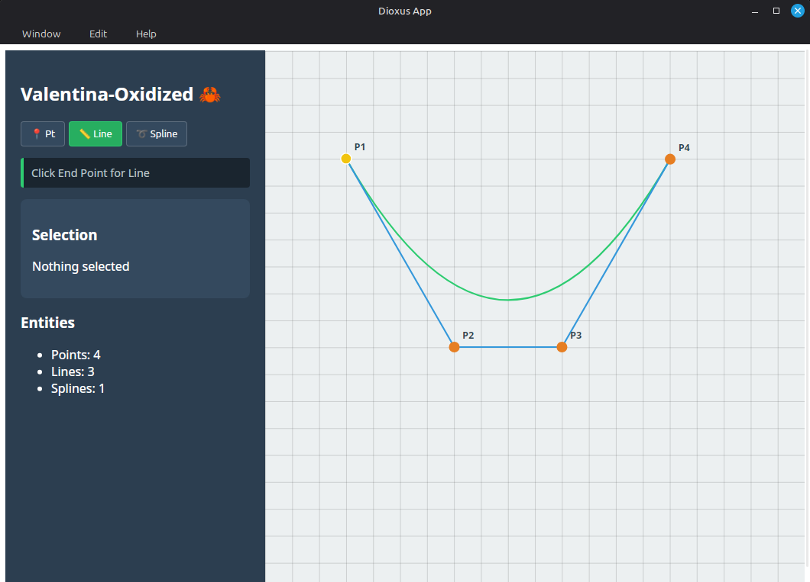

# Valentina-Oxidized 🦀📐

**Learning Rust by re-engineering the Valentina CAD engine.**

---

## 🌟 Overview
**Valentina-Oxidized** is an ambitious project to migrate and reimagine the core engine of [Valentina](https://gitlab.com/smart-pattern/valentina) from C++ to Rust. Focused on safety, performance, and modern software design using **Dioxus 0.7** and **SVG**.

---

## 📸 Stage 3 Preview

*Interactive Canvas featuring Points, Lines, Bezier Splines, and Angle Bisectors.*

---

## 🏗️ The Architectural Approach
1. **Deconstruction:** Analyzing C++/Qt memory layout and signal-based logic.
2. **Mapping:** Finding Idiomatic Rust equivalents (Composition & ID-based Linking).
3. **Refactoring:** Leveraging Rust’s Memory Safety without sacrificing performance.

| C++ Concept | Rust Equivalent | Architectural Reasoning |
| --- | --- | --- |
| **Class Inheritance** | **Composition** | Decoupling behavior from state for better maintainability. |
| **Raw Pointers** | **ID-based Linking** | Solving the Borrow Checker graph problem safely. |
| **Qt Framework** | **Dioxus + SVG** | Modern, reactive, and vector-perfect cross-platform GUI. |

---

## 🚀 Current Features (Stage 3 Stable)
- **High-Precision Geometry**: Full support for Points, Segments, and Cubic Bezier Splines.
- **Advanced Tools**: Automated Angle Bisector calculation based on original Valentina logic.
- **Interactive UI**: Real-time **Drag & Drop** for points with live dependency updates.
- **Global Selection**: CSS-powered visual feedback (Hover/Glow) for all geometric entities.
- **Data Integrity**: Cascading deletion logic to prevent orphaned relationships.
- **Project Persistence**: Save and Load projects using Native OS File Dialogs (JSON format).

---

## 📅 The Educational Journey
Explore our detailed engineering logs in the [lessons/](./lessons/) directory:
* **[Stage 1: Foundation](./lessons/stage-1-foundation.md):** Mathematical primitives and C++ Deconstruction.
* **[Stage 2: Core GUI](./lessons/stage-2-core-gui.md):** Identity, Dioxus Integration, and Linux Linker challenges.
* **[Stage 3: Entities & Relationships](./lessons/stage-3-entities-relationships.md):** **(Completed)** The Deep-Dive into Graphs, Snapshots, and CAD logic.

---

## 📓 Strategic Documentation
For high-level insights and the project's future, visit our [docs/](./docs/) directory:
* **[Insights & Pitfalls](./docs/INSIGHTS.md):** Lessons learned from the Rust/Dioxus transition.
* **[Interactive Roadmap](./docs/ROADMAP.md):** The path to Milestone 6 and beyond.

---

## 🛠️ Development Setup

```bash
# Clone the repository
git clone https://github.com/tharwaatt/valentina-oxidized

# Build & Run
cargo run
```
